# Polyglot Codebase Knowledge Graph

> Generated offline by **readmenator**. Supports C, C++, Python, Go, Rust, JS/TS, Java, C#, Shell, PHP, Dart, GDScript, Nim, ASM.
> No LLMs. No tokens. Pure static analysis. See more [here](https://github.com/grisuno/ReadMenator)

**Total Files Parsed:** 36 | **Total Symbols Extracted:** 2 | **Total Imports:** 72

## Structural Knowledge Map

```mermaid
graph TD
    classDef mod fill:#1e1e1e,stroke:#ff6666,stroke-width:2px,color:#fff;
    classDef cls fill:#2d2d2d,stroke:#4ec9b0,stroke-width:2px,color:#fff;
    classDef fn fill:#333,stroke:#dcdcaa,stroke-width:1px,color:#dcdcaa;
    classDef ext fill:#111,stroke:#666,stroke-dasharray:5 5,color:#aaa;
    pages_HomePage_tsx["HomePage.tsx (tsx)"]
    class pages_HomePage_tsx mod;
    App_tsx["App.tsx (tsx)"]
    class App_tsx mod;
    constants_ts["constants.ts (ts)"]
    class constants_ts mod;
    pages_AboutPage_tsx["AboutPage.tsx (tsx)"]
    class pages_AboutPage_tsx mod;
    components_Navbar_tsx["Navbar.tsx (tsx)"]
    class components_Navbar_tsx mod;
    components_HeroSection_tsx["HeroSection.tsx (tsx)"]
    class components_HeroSection_tsx mod;
    pages_BlogPage_tsx["BlogPage.tsx (tsx)"]
    class pages_BlogPage_tsx mod;
    pages_ContactPage_tsx["ContactPage.tsx (tsx)"]
    class pages_ContactPage_tsx mod;
    pages_FrameworkPage_tsx["FrameworkPage.tsx (tsx)"]
    class pages_FrameworkPage_tsx mod;
    pages_ServicesPage_tsx["ServicesPage.tsx (tsx)"]
    class pages_ServicesPage_tsx mod;
    components_BlogPostCard_tsx["BlogPostCard.tsx (tsx)"]
    class components_BlogPostCard_tsx mod;
    components_ServiceCard_tsx["ServiceCard.tsx (tsx)"]
    class components_ServiceCard_tsx mod;
    components_Footer_tsx["Footer.tsx (tsx)"]
    class components_Footer_tsx mod;
    components_ContactForm_tsx["ContactForm.tsx (tsx)"]
    class components_ContactForm_tsx mod;
    components_ContactForm_tsx_handleSubmit["handleSubmit"]
    class components_ContactForm_tsx_handleSubmit fn;
    components_ContactForm_tsx --> components_ContactForm_tsx_handleSubmit
    components_ui_Button_tsx["Button.tsx (tsx)"]
    class components_ui_Button_tsx mod;
    components_ui_Button_tsx_content["content"]
    class components_ui_Button_tsx_content fn;
    components_ui_Button_tsx --> components_ui_Button_tsx_content
    components_TeamMemberCard_tsx["TeamMemberCard.tsx (tsx)"]
    class components_TeamMemberCard_tsx mod;
    components_TestimonialCard_tsx["TestimonialCard.tsx (tsx)"]
    class components_TestimonialCard_tsx mod;
    vite_config_ts["vite.config.ts (ts)"]
    class vite_config_ts mod;
    app_py["app.py (py)"]
    class app_py mod;
    components_SectionTitle_tsx["SectionTitle.tsx (tsx)"]
    class components_SectionTitle_tsx mod;
    components_icons_BriefcaseIcon_tsx["BriefcaseIcon.tsx (tsx)"]
    class components_icons_BriefcaseIcon_tsx mod;
    components_icons_ChevronRightIcon_tsx["ChevronRightIcon.tsx (tsx)"]
    class components_icons_ChevronRightIcon_tsx mod;
    components_icons_CodeIcon_tsx["CodeIcon.tsx (tsx)"]
    class components_icons_CodeIcon_tsx mod;
    components_icons_LinkedInIcon_tsx["LinkedInIcon.tsx (tsx)"]
    class components_icons_LinkedInIcon_tsx mod;
    components_icons_LockIcon_tsx["LockIcon.tsx (tsx)"]
    class components_icons_LockIcon_tsx mod;
    components_icons_MenuIcon_tsx["MenuIcon.tsx (tsx)"]
    class components_icons_MenuIcon_tsx mod;
    components_icons_NetworkIcon_tsx["NetworkIcon.tsx (tsx)"]
    class components_icons_NetworkIcon_tsx mod;
    components_icons_PuzzlePieceIcon_tsx["PuzzlePieceIcon.tsx (tsx)"]
    class components_icons_PuzzlePieceIcon_tsx mod;
    components_icons_ShieldIcon_tsx["ShieldIcon.tsx (tsx)"]
    class components_icons_ShieldIcon_tsx mod;
    components_icons_TargetIcon_tsx["TargetIcon.tsx (tsx)"]
    class components_icons_TargetIcon_tsx mod;
    components_icons_TwitterIcon_tsx["TwitterIcon.tsx (tsx)"]
    class components_icons_TwitterIcon_tsx mod;
    components_icons_UserGroupIcon_tsx["UserGroupIcon.tsx (tsx)"]
    class components_icons_UserGroupIcon_tsx mod;
    components_icons_XIcon_tsx["XIcon.tsx (tsx)"]
    class components_icons_XIcon_tsx mod;
    index_tsx["index.tsx (tsx)"]
    class index_tsx mod;
    install_sh["install.sh (sh)"]
    class install_sh mod;
    types_ts["types.ts (ts)"]
    class types_ts mod;
    ext_react_router_dom["react-router-dom"]
    class ext_react_router_dom ext;
    App_tsx -.->|imports| ext_react_router_dom
    ext___components_Navbar["Navbar"]
    class ext___components_Navbar ext;
    App_tsx -.->|imports| ext___components_Navbar
    ext___components_Footer["Footer"]
    class ext___components_Footer ext;
    App_tsx -.->|imports| ext___components_Footer
    ext___pages_HomePage["HomePage"]
    class ext___pages_HomePage ext;
    App_tsx -.->|imports| ext___pages_HomePage
    ext___pages_AboutPage["AboutPage"]
    class ext___pages_AboutPage ext;
    App_tsx -.->|imports| ext___pages_AboutPage
    ext___pages_ServicesPage["ServicesPage"]
    class ext___pages_ServicesPage ext;
    App_tsx -.->|imports| ext___pages_ServicesPage
    ext___pages_FrameworkPage["FrameworkPage"]
    class ext___pages_FrameworkPage ext;
    App_tsx -.->|imports| ext___pages_FrameworkPage
    ext___pages_BlogPage["BlogPage"]
    class ext___pages_BlogPage ext;
    App_tsx -.->|imports| ext___pages_BlogPage
    ext___pages_ContactPage["ContactPage"]
    class ext___pages_ContactPage ext;
    App_tsx -.->|imports| ext___pages_ContactPage
    components_BlogPostCard_tsx -.->|imports| ext_react_router_dom
    ext____types["types"]
    class ext____types ext;
    components_BlogPostCard_tsx -.->|imports| ext____types
    ext___icons_ChevronRightIcon["ChevronRightIcon"]
    class ext___icons_ChevronRightIcon ext;
    components_BlogPostCard_tsx -.->|imports| ext___icons_ChevronRightIcon
    ext___ui_Button["Button"]
    class ext___ui_Button ext;
    components_ContactForm_tsx -.->|imports| ext___ui_Button
    components_Footer_tsx -.->|imports| ext_react_router_dom
    ext____constants["constants"]
    class ext____constants ext;
    components_Footer_tsx -.->|imports| ext____constants
    components_HeroSection_tsx -.->|imports| ext___ui_Button
    components_HeroSection_tsx -.->|imports| ext____constants
    components_HeroSection_tsx -.->|imports| ext___icons_ChevronRightIcon
    ext___icons_CodeIcon["CodeIcon"]
    class ext___icons_CodeIcon ext;
    components_HeroSection_tsx -.->|imports| ext___icons_CodeIcon
    components_Navbar_tsx -.->|imports| ext_react_router_dom
    components_Navbar_tsx -.->|imports| ext____constants
    ext___icons_MenuIcon["MenuIcon"]
    class ext___icons_MenuIcon ext;
    components_Navbar_tsx -.->|imports| ext___icons_MenuIcon
    ext___icons_XIcon["XIcon"]
    class ext___icons_XIcon ext;
    components_Navbar_tsx -.->|imports| ext___icons_XIcon
    ext___icons_ShieldIcon["ShieldIcon"]
    class ext___icons_ShieldIcon ext;
    components_Navbar_tsx -.->|imports| ext___icons_ShieldIcon
    components_ServiceCard_tsx -.->|imports| ext_react_router_dom
    components_ServiceCard_tsx -.->|imports| ext____types
    components_ServiceCard_tsx -.->|imports| ext___icons_ChevronRightIcon
    components_TeamMemberCard_tsx -.->|imports| ext____types
    components_TestimonialCard_tsx -.->|imports| ext____types
    components_ui_Button_tsx -.->|imports| ext_react_router_dom
    ext___types["types"]
    class ext___types ext;
    constants_ts -.->|imports| ext___types
    ext___components_icons_ShieldIcon["ShieldIcon"]
    class ext___components_icons_ShieldIcon ext;
    constants_ts -.->|imports| ext___components_icons_ShieldIcon
    ext___components_icons_TargetIcon["TargetIcon"]
    class ext___components_icons_TargetIcon ext;
    constants_ts -.->|imports| ext___components_icons_TargetIcon
    ext___components_icons_CodeIcon["CodeIcon"]
    class ext___components_icons_CodeIcon ext;
    constants_ts -.->|imports| ext___components_icons_CodeIcon
    ext___components_icons_LinkedInIcon["LinkedInIcon"]
    class ext___components_icons_LinkedInIcon ext;
    constants_ts -.->|imports| ext___components_icons_LinkedInIcon
    ext___components_icons_TwitterIcon["TwitterIcon"]
    class ext___components_icons_TwitterIcon ext;
    constants_ts -.->|imports| ext___components_icons_TwitterIcon
    ext___components_icons_PuzzlePieceIcon["PuzzlePieceIcon"]
    class ext___components_icons_PuzzlePieceIcon ext;
    constants_ts -.->|imports| ext___components_icons_PuzzlePieceIcon
    ext___components_icons_NetworkIcon["NetworkIcon"]
    class ext___components_icons_NetworkIcon ext;
    constants_ts -.->|imports| ext___components_icons_NetworkIcon
    ext___components_icons_LockIcon["LockIcon"]
    class ext___components_icons_LockIcon ext;
    constants_ts -.->|imports| ext___components_icons_LockIcon
    ext____components_SectionTitle["SectionTitle"]
    class ext____components_SectionTitle ext;
    pages_AboutPage_tsx -.->|imports| ext____components_SectionTitle
    ext____components_TeamMemberCard["TeamMemberCard"]
    class ext____components_TeamMemberCard ext;
    pages_AboutPage_tsx -.->|imports| ext____components_TeamMemberCard
    pages_AboutPage_tsx -.->|imports| ext____constants
    ext____components_icons_ShieldIcon["ShieldIcon"]
    class ext____components_icons_ShieldIcon ext;
    pages_AboutPage_tsx -.->|imports| ext____components_icons_ShieldIcon
    ext____components_icons_TargetIcon["TargetIcon"]
    class ext____components_icons_TargetIcon ext;
    pages_AboutPage_tsx -.->|imports| ext____components_icons_TargetIcon
    ext____components_icons_CodeIcon["CodeIcon"]
    class ext____components_icons_CodeIcon ext;
    pages_AboutPage_tsx -.->|imports| ext____components_icons_CodeIcon
    pages_BlogPage_tsx -.->|imports| ext_react_router_dom
    pages_BlogPage_tsx -.->|imports| ext____components_SectionTitle
    ext____components_BlogPostCard["BlogPostCard"]
    class ext____components_BlogPostCard ext;
    pages_BlogPage_tsx -.->|imports| ext____components_BlogPostCard
    pages_BlogPage_tsx -.->|imports| ext____constants
    pages_ContactPage_tsx -.->|imports| ext____components_SectionTitle
    ext____components_ContactForm["ContactForm"]
    class ext____components_ContactForm ext;
    pages_ContactPage_tsx -.->|imports| ext____components_ContactForm
    pages_ContactPage_tsx -.->|imports| ext____constants
    ext____components_icons_LockIcon["LockIcon"]
    class ext____components_icons_LockIcon ext;
    pages_ContactPage_tsx -.->|imports| ext____components_icons_LockIcon
    pages_FrameworkPage_tsx -.->|imports| ext____components_SectionTitle
    ext____components_ui_Button["Button"]
    class ext____components_ui_Button ext;
    pages_FrameworkPage_tsx -.->|imports| ext____components_ui_Button
    pages_FrameworkPage_tsx -.->|imports| ext____constants
    ext____components_icons_PuzzlePieceIcon["PuzzlePieceIcon"]
    class ext____components_icons_PuzzlePieceIcon ext;
    pages_FrameworkPage_tsx -.->|imports| ext____components_icons_PuzzlePieceIcon
    ext____components_HeroSection["HeroSection"]
    class ext____components_HeroSection ext;
    pages_HomePage_tsx -.->|imports| ext____components_HeroSection
    pages_HomePage_tsx -.->|imports| ext____components_SectionTitle
    ext____components_ServiceCard["ServiceCard"]
    class ext____components_ServiceCard ext;
    pages_HomePage_tsx -.->|imports| ext____components_ServiceCard
    ext____components_TestimonialCard["TestimonialCard"]
    class ext____components_TestimonialCard ext;
    pages_HomePage_tsx -.->|imports| ext____components_TestimonialCard
    pages_HomePage_tsx -.->|imports| ext____constants
    pages_HomePage_tsx -.->|imports| ext____components_ui_Button
    pages_HomePage_tsx -.->|imports| ext_react_router_dom
    ext____components_icons_ChevronRightIcon["ChevronRightIcon"]
    class ext____components_icons_ChevronRightIcon ext;
    pages_HomePage_tsx -.->|imports| ext____components_icons_ChevronRightIcon
    pages_HomePage_tsx -.->|imports| ext____components_icons_PuzzlePieceIcon
    ext____components_icons_UserGroupIcon["UserGroupIcon"]
    class ext____components_icons_UserGroupIcon ext;
    pages_HomePage_tsx -.->|imports| ext____components_icons_UserGroupIcon
    pages_ServicesPage_tsx -.->|imports| ext_react_router_dom
    pages_ServicesPage_tsx -.->|imports| ext____components_SectionTitle
    pages_ServicesPage_tsx -.->|imports| ext____constants
    pages_ServicesPage_tsx -.->|imports| ext____components_ui_Button
    ext_vite["vite"]
    class ext_vite ext;
    vite_config_ts -.->|imports| ext_vite
```

---

## Architecture Reference

### PY (1 files)

#### `app.py`
**Path:** `app.py`

*No symbols extracted*

### SH (1 files)

#### `install.sh`
**Path:** `install.sh`

*No symbols extracted*

### TS (3 files)

#### `constants.ts`
**Path:** `constants.ts`

*No symbols extracted*

#### `types.ts`
**Path:** `types.ts`

*No symbols extracted*

#### `vite.config.ts`
**Path:** `vite.config.ts`

*No symbols extracted*

### TSX (31 files)

#### `App.tsx`
**Path:** `App.tsx`

*No symbols extracted*

#### `BlogPostCard.tsx`
**Path:** `components/BlogPostCard.tsx`

*No symbols extracted*

#### `ContactForm.tsx`
**Path:** `components/ContactForm.tsx`

**Functions:**
- `handleSubmit` (line 11)

#### `Footer.tsx`
**Path:** `components/Footer.tsx`

*No symbols extracted*

#### `HeroSection.tsx`
**Path:** `components/HeroSection.tsx`

*No symbols extracted*

#### `Navbar.tsx`
**Path:** `components/Navbar.tsx`

*No symbols extracted*

#### `SectionTitle.tsx`
**Path:** `components/SectionTitle.tsx`

*No symbols extracted*

#### `ServiceCard.tsx`
**Path:** `components/ServiceCard.tsx`

*No symbols extracted*

#### `TeamMemberCard.tsx`
**Path:** `components/TeamMemberCard.tsx`

*No symbols extracted*

#### `TestimonialCard.tsx`
**Path:** `components/TestimonialCard.tsx`

*No symbols extracted*

#### `BriefcaseIcon.tsx`
**Path:** `components/icons/BriefcaseIcon.tsx`

*No symbols extracted*

#### `ChevronRightIcon.tsx`
**Path:** `components/icons/ChevronRightIcon.tsx`

*No symbols extracted*

#### `CodeIcon.tsx`
**Path:** `components/icons/CodeIcon.tsx`

*No symbols extracted*

#### `LinkedInIcon.tsx`
**Path:** `components/icons/LinkedInIcon.tsx`

*No symbols extracted*

#### `LockIcon.tsx`
**Path:** `components/icons/LockIcon.tsx`

*No symbols extracted*

#### `MenuIcon.tsx`
**Path:** `components/icons/MenuIcon.tsx`

*No symbols extracted*

#### `NetworkIcon.tsx`
**Path:** `components/icons/NetworkIcon.tsx`

*No symbols extracted*

#### `PuzzlePieceIcon.tsx`
**Path:** `components/icons/PuzzlePieceIcon.tsx`

*No symbols extracted*

#### `ShieldIcon.tsx`
**Path:** `components/icons/ShieldIcon.tsx`

*No symbols extracted*

#### `TargetIcon.tsx`
**Path:** `components/icons/TargetIcon.tsx`

*No symbols extracted*

#### `TwitterIcon.tsx`
**Path:** `components/icons/TwitterIcon.tsx`

*No symbols extracted*

#### `UserGroupIcon.tsx`
**Path:** `components/icons/UserGroupIcon.tsx`

*No symbols extracted*

#### `XIcon.tsx`
**Path:** `components/icons/XIcon.tsx`

*No symbols extracted*

#### `Button.tsx`
**Path:** `components/ui/Button.tsx`

**Functions:**
- `content` (line 41)

#### `index.tsx`
**Path:** `index.tsx`

*No symbols extracted*

#### `AboutPage.tsx`
**Path:** `pages/AboutPage.tsx`

*No symbols extracted*

#### `BlogPage.tsx`
**Path:** `pages/BlogPage.tsx`

*No symbols extracted*

#### `ContactPage.tsx`
**Path:** `pages/ContactPage.tsx`

*No symbols extracted*

#### `FrameworkPage.tsx`
**Path:** `pages/FrameworkPage.tsx`

*No symbols extracted*

#### `HomePage.tsx`
**Path:** `pages/HomePage.tsx`

*No symbols extracted*

#### `ServicesPage.tsx`
**Path:** `pages/ServicesPage.tsx`

*No symbols extracted*
